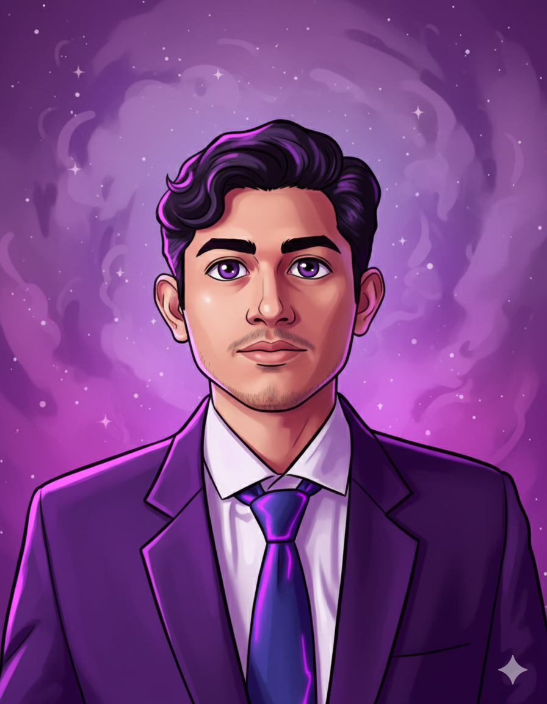
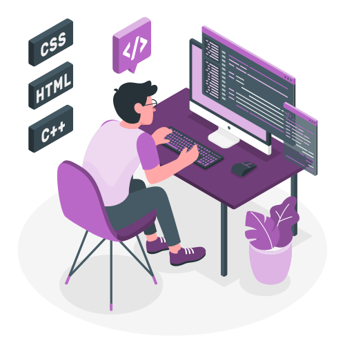

<!-- COSMIC THEME README START -->

<!-- Header Banner with Capsule Render -->

<!-- Profile Photo Frame -->

 

<!-- Typing Animation -->

 
 

<!-- Social Badges -->
<!-- Purple Themed Contact Section -->

  
  
  

 

<!-- About Me Section -->

  

<!-- Developer Illustration -->

I'm a **MERN Stack Developer** passionate about building **scalable** and **user-friendly web applications**. 
I thrive on solving challenging problems, crafting clean code, and designing digital experiences that make an impact. 
My mission is to merge *creativity* with *technology* to bring ideas to life.

<!-- Info Badges using shields.io -->

 

<!-- Skills Illustration -->

  

  

<!-- 🔤 Languages -->

  

| C | C++ | JavaScript |
|---|---|---|
|  |  |  |

---

<!-- 🖥️ Frontend -->

  

| React | TailwindCSS | Redux | Framer Motion | Chart.js |
|---|---|---|---|---|
|  |  |  |  |  |

---

<!-- ⚙️ Backend -->

  

| Node.js | Express.js | REST API |
|---|---|---|
|  |  |  |

---

<!-- 💾 Databases -->

  

| MongoDB | PostgreSQL | MySQL |
|---|---|---|
|  |  |  |

---

<!-- 🧪 Tools & Others -->

  

| Git | GitHub | VS Code | Figma |
|---|---|---|---|
|  |  |  |  |

 

<!-- GitHub Stats Cards -->

  

<table>
  <tr>
    <td align="center" width="50%">
      
    </td>
    <td align="center" width="50%">
      
    </td>
  </tr>
  <tr>
    <td colspan="2" align="center">
      
    </td>
  </tr>
</table>

  <picture>
    <source
      media="(prefers-color-scheme: dark)"
      srcset="https://raw.githubusercontent.com/Soumik-Coder18/Soumik-Coder18/main/dist/github-contribution-grid-snake-dark.svg"
    />
    <source
      media="(prefers-color-scheme: light)"
      srcset="https://raw.githubusercontent.com/Soumik-Coder18/Soumik-Coder18/main/dist/github-contribution-grid-snake.svg"
    />
    
  </picture>

<!--GitHub Trophies-->

  

<!--Featured Projects-->

  

<!-- 🌌 Featured Projects Section -->

  

  
Your AI-powered cooking companion. Discover recipes, manage grocery lists, and get step-by-step instructions.

  

    
    
    
  

  

    
    
  

---

  

  
A modern OTT platform with real-time search, authentication, and personalized recommendations.

  

    
    
    
    
  

  

    
    
  

---

  

  
A robust farmer-to-customer marketplace with real-time inventory, secure payments, and seamless delivery. Awarded 1st Runner-Up at Inspirit 2025.

  <!-- Tech Stack -->
  

    
    
    
    
    
  

  <!-- Links -->
  

    
    
  

---

  

  
A smart event management platform with RSVP tracking, reminders, and social sharing tools.

  

    
    
    
  

  

    
    
  

<!-- Contact Illustration -->

  

<table align="center">
  <tr>
    <!-- Left: Large Contact Illustration -->
    <td align="center" width="40%">
      
    </td>
<!-- Right: Stacked Purple Social Badges -->
    <td align="center" width="60%">
      

        
      

      

        
      

      

        
      

      

        
      

      

        
      

    </td>
  </tr>
</table>

 

---

<!-- LeetCode Section -->

  

<!-- LeetCode Card -->

<!-- LeetCode Profile Badge -->

  

 

---

<!-- 🌌 Footer Section -->

  

  

    Thank you for visiting! 
    Made with ❤️ by <strong>Soumik Bag</strong> 
  

<!-- COSMIC THEME README END -->
